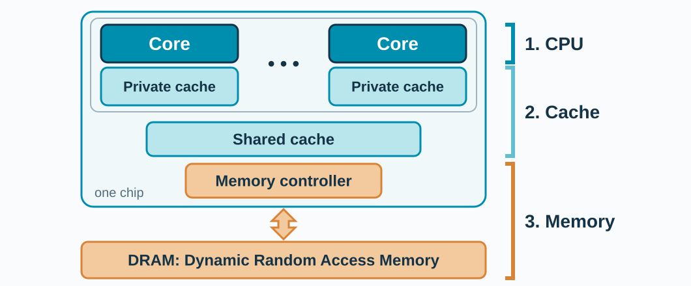

<!-- _class: title -->

## What happens when we press RUN?

```c
int a = 10;
int b = 20;
int c = a + b;
```

<!-- Open with the actual program in examples/simple/main.c. Take guesses before introducing the CPU. The compiler may simplify this exact example; we are using it to ask what work the machine must represent. -->

---

## The computer hierarchy



**CPU ↔ Cache ↔ Memory.** We visit them in this order.

<!-- Adapted from the System Architecture slide in GEA Presentation 2. Each core has its own private cache; all cores share a larger cache; the memory controller on the chip talks to the DRAM chips outside. Data moves in both directions. Our gem5 model has one core, private L1 caches, a shared L2 cache, and DDR3 DRAM. Use this slide as the roadmap: first the CPU, then caches, and at the end memory. -->
