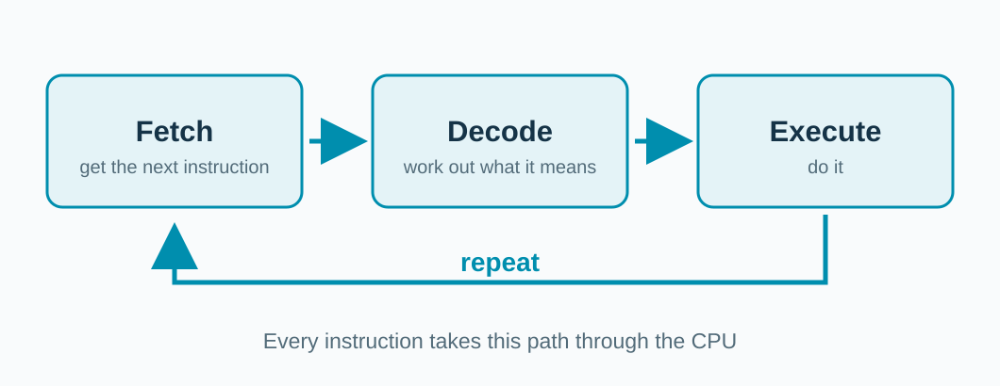

<!-- _class: title -->

## The CPU needs the values before it can add.

**a = 10**　　　　**b = 20**

Then it can compute **c = 30**.

---

## What is a CPU?

**CPU = Central Processing Unit.**

It runs a program by following its instructions, one small step at a time.

It is built from tiny switches called **transistors**. Apple's M4 chip has **28 billion** of them.

<!-- A transistor is an electrically controlled switch: current flows or it does not. Billions of them form the CPU's circuits. The M4 figure counts the whole chip, including its graphics and other units, not only the CPU cores. Sources: imec, "What's a transistor and how does it work?", https://www.imec-int.com/en/semiconductor-education-and-workforce-development/microchips/history-microchips/transistors ; Apple, "Apple introduces M4 chip" (May 2024): "M4 consists of 28 billion transistors", https://www.apple.com/newsroom/2024/05/apple-introduces-m4-chip/ . -->

---

## Everything is stored as 0s and 1s.

A switch is off or on: **0** or **1**. One 0 or 1 is a **bit**.

**8 bits = 1 byte.**

```text
10  =  00001010
20  =  00010100
30  =  00011110
```

<!-- Numbers, letters, and even instructions are all stored as bits. The table shows our three values as one byte each; an int in our C examples uses 4 bytes (32 bits). Ask the room to check 00001010 = 8 + 2. Source: Khan Academy, "Bits (binary digits)", https://www.khanacademy.org/computing/computers-and-internet/xcae6f4a7ff015e7d:digital-information/xcae6f4a7ff015e7d:bits-and-bytes/a/bits-binary-digits . -->

---

## What is inside a CPU?


**Control chooses. Registers hold. Arithmetic computes.**

<!-- These are roles inside a CPU core, not a three-stage pipeline. Ask which part holds a value the CPU is using right now. Hardware implementations vary. -->

---

## The CPU repeats three steps.



**Fetch** the next instruction. **Decode** it. **Execute** it. Repeat.

<!-- This loop is called the fetch-decode-execute cycle. The program counter holds the address of the next instruction; control decodes it; the arithmetic unit, registers, or memory carry it out. The next slides trace these steps for one small program. Real CPUs overlap the steps of different instructions (pipelining); we do not need that today. Source: C. Cafiero, "Fetch, decode, execute (repeat!)", University of Vermont CS 2210 notes, https://www.uvm.edu/~cbcafier/cs2210/content/02_basics_of_architecture/fetch_decode_execute.html . -->
