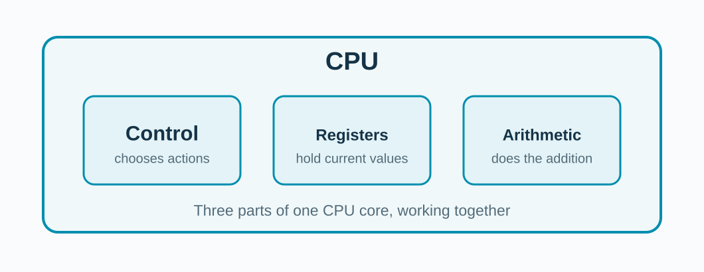

<!-- _class: title -->

## The CPU needs the values before it can add.

**a = 10**　　　　**b = 20**

Then it can compute **c = 30**.

<!-- Ask the audience what would happen if a and b were in a large array that was not nearby. This conceptual illustration introduces the CPU before discussing memory. Actual compilers may use registers or fold constants in the opening example. -->

---

## What is inside our simple CPU picture?

**Control chooses. Registers hold. Arithmetic computes.**

<!-- These are roles inside a CPU core, not a three-stage pipeline. Ask which part holds a value the CPU is using right now. Hardware implementations vary. -->
