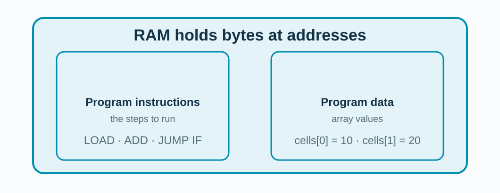
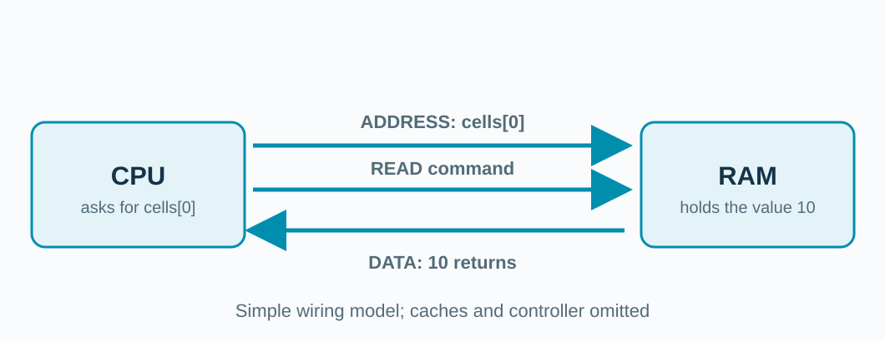
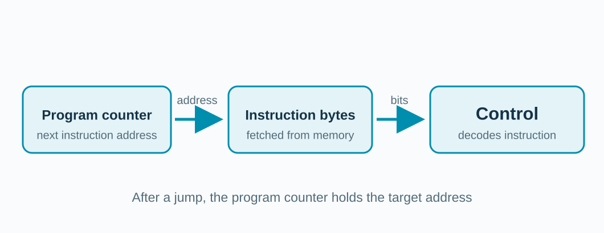
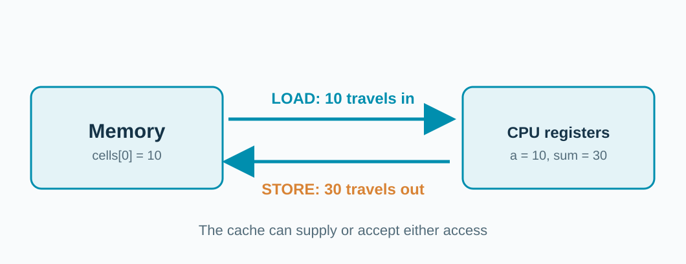
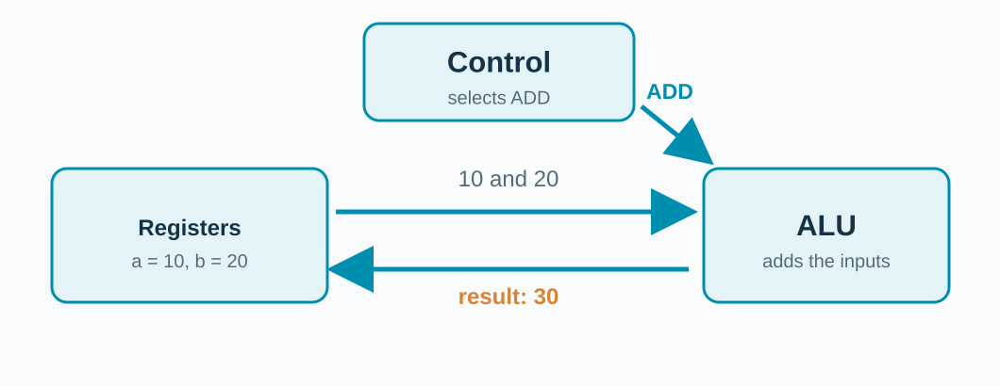
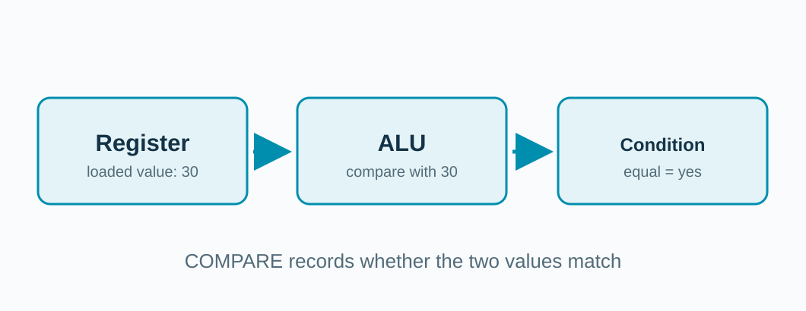
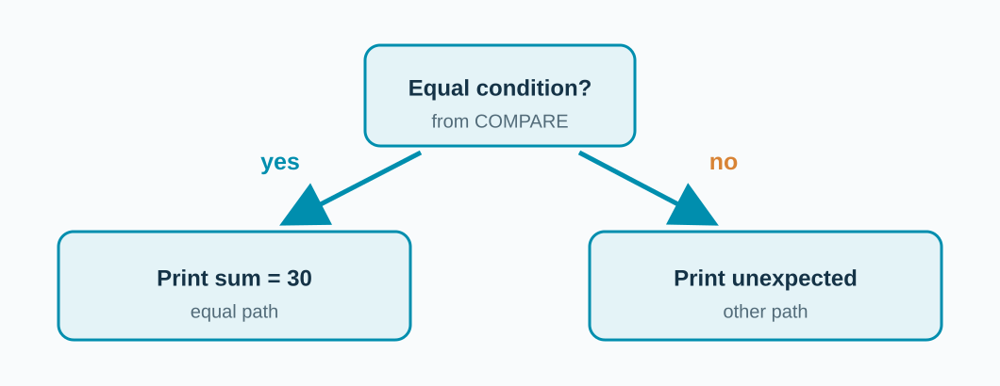

## One small program to trace

```c
int a = cells[0];      // 10
int b = cells[1];      // 20
int sum = a + b;
cells[2] = sum;
if (cells[2] == 30) puts("sum = 30");
```

**What happens inside the machine before it prints?**

<!-- Run examples/simple/cpu_walkthrough after the prediction. The complete C source declares volatile cells[3] = {10, 20, 0} and includes an else branch. Volatile makes the data accesses observable to the compiler for this demonstration. These slides show conceptual actions, not a promise of a particular x86 instruction sequence. -->

---

## Memory holds instructions and data



Main memory is **Random Access Memory (RAM)**.

**A fetch reads an instruction. LOAD reads a data value.**

<!-- A program counter points to an instruction. A LOAD addresses program data. Both can reside in RAM, though modern CPUs normally access them through different cache paths. Addresses in the drawing are conceptual; no actual binary layout is claimed. Source concept: How a CPU Works, 04:01–05:25, https://www.youtube.com/watch?v=cNN_tTXABUA. -->

---

## A RAM read uses three kinds of signals



**ADDRESS: where? READ: what action? DATA: the reply.**

<!-- Walk through reading cells[0], whose value is 10. The address and read command travel toward memory; the value returns. These are logical signal groups, not a motherboard pinout. This is the video's simple wiring model (02:59–03:56). In our gem5 computer, the CPU consults caches, and the memory controller drives DRAM if necessary. -->

---

## The program counter selects the next instruction



**Usually it advances. A jump can give it a different address.**

<!-- PC means program counter, or instruction address register in the teaching CPU. The fetched instruction reaches an instruction register and is decoded by control. We omit instruction caches from this drawing for clarity. The video describes this path around 15:36–16:38. A jump changes the next instruction address, not the data value in cells[2]. -->

---

## LOAD and STORE move values



**LOAD `cells[0]` gives us 10. STORE puts 30 in `cells[2]`.**

<!-- Repeat for cells[1] = 20. LOAD and STORE are conceptual operation names: the precise x86 instructions and register allocation depend on compilation. Accesses may hit in a CPU cache, so this diagram is about direction and ownership of data, not a physical DRAM trip for every statement. The video introduces loads and stores around 05:25. -->

---

## Control tells the ALU to add



**The Arithmetic Logic Unit (ALU) computes 10 + 20; a register holds 30.**

<!-- Read the arrows by their labels, rather than as a time line. Control decodes an ADD-like operation and selects the ALU function; registers provide two values and receive the result. The Scott CPU in the video shows control, ALU, registers, and enable/set wires around 08:49–13:22. A real x86 core is much more elaborate. -->

---

## COMPARE answers a yes-or-no question

```c
if (cells[2] == 30)
    puts("sum = 30");
```



<!-- First the CPU obtains cells[2]. Conceptually, the ALU compares it with 30 and records the equal result in condition flags. This is not the same operation as storing 30; the comparison asks a question about values already available. The video introduces compare and flags around 09:11–10:26 and 13:51–15:31. -->

---

## JUMP IF uses the comparison result



**JUMP goes to its target. JUMP IF checks the condition.**

<!-- JUMP picks a new instruction address unconditionally. JUMP IF does so only when its condition holds; otherwise execution continues along the other path. A compiler can arrange which path is the branch target, so the two arrows are conceptual outcomes, not specific x86 branch opcodes. The video describes JUMP and JUMP IF at 06:17–06:38 and 16:38–17:15. -->
