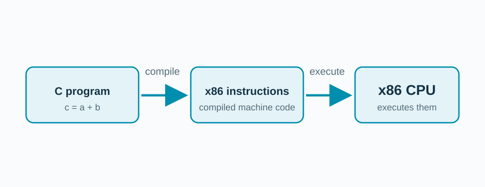

<!-- _class: title -->

## The CPU follows an instruction vocabulary.

Loads get data. Stores save it. Arithmetic changes it. Jumps choose what comes next.

<!-- Use a cooking analogy: each instruction is a very small kitchen action; the exact mix depends on compiler and ISA. -->

---

## Processors understand different languages.

x86, Arm, and RISC-V are **Instruction Set Architectures (ISA)**.

<!-- Explain ISA as the visible contract: the code a processor knows how to execute. Recompile C for a different target ISA. -->

---

## A clock sets the pace.

Each tick of the clock is one **cycle**.

**1 GHz = 1 billion cycles per second.**

A **2 GHz** CPU ticks 2 billion times every second.

<!-- The clock keeps every part of the CPU in step. A faster clock gives more cycles each second, so more fetch-decode-execute steps can finish. One instruction can take several cycles, and waiting for memory adds more; later we count cache time in cycles. Our gem5 model runs at 2 GHz (clk_freq in configs/workshop.py). Source: CSNewbs, OCR GCSE 1.2 CPU performance, https://www.csnewbs.com/ocr2020-1-2-cpuperformance . -->

---

## More instructions per second can mislead.

**MIPS = Millions of Instructions Per Second.**

Finishing a job matters more than the rate of counting steps.

<!-- One walker takes five steps, another ten. Ask whether step rate alone settles which arrives first. Compare a fixed task and simulated seconds later. -->

---

## One chip can have many cores.

Each **core** fetches, decodes, and executes its own instructions.

Apple's M4 chip has up to **10 CPU cores**.

More cores help only when the work can be split.

<!-- Point back to the hierarchy slide: several cores, each with a private cache, share one larger cache and the memory. Our gem5 model uses one core, so each result is easy to explain. Sources: CSNewbs, OCR GCSE 1.2 CPU performance, https://www.csnewbs.com/ocr2020-1-2-cpuperformance ; Apple, "Apple introduces M4 chip" (May 2024): "up-to-10-core CPU", https://www.apple.com/newsroom/2024/05/apple-introduces-m4-chip/ . -->

---

## What makes a CPU faster?

**Clock speed:** more cycles each second.

**More cores:** more instructions at the same time.

**Cache size:** more data kept close to the CPU.

Next: the cache.

<!-- These three factors appear in introductory computer science courses. A faster clock helps only while the CPU is not waiting for data; more cores help only if the program can use them. The rest of the workshop is about the third factor and the memory behind it. Source: CSNewbs, OCR GCSE 1.2 CPU performance, https://www.csnewbs.com/ocr2020-1-2-cpuperformance . -->
