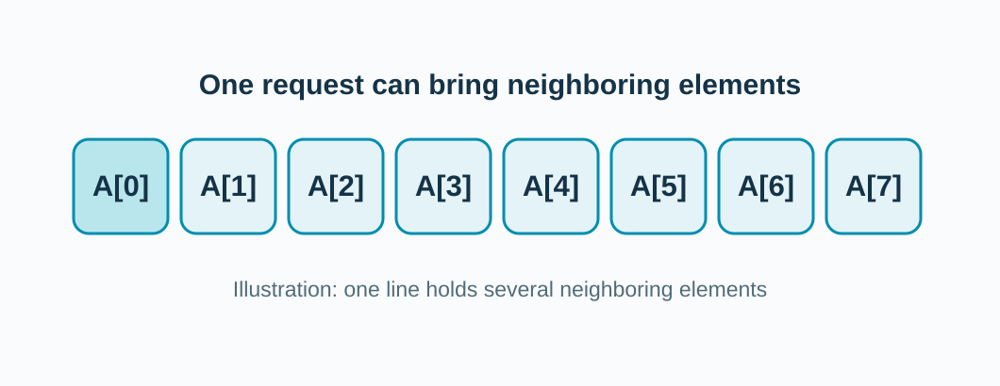
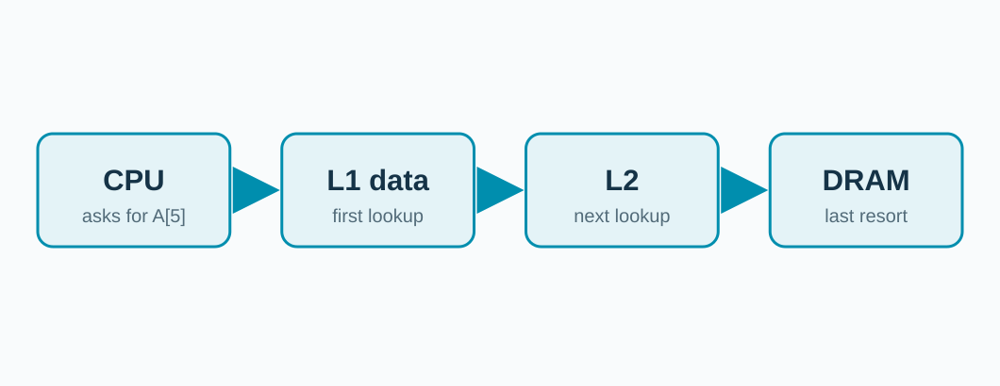

<!-- _class: title -->

## Meet the cache.

![CPU request for A[5] through a cache toward DRAM width:970px](../../assets/diagrams/cache-structure.svg)

**It keeps copies of data the CPU may use again.**

<!-- The colored blocks inside the cache stand for cache lines. The CPU asks for A[5]. The cache checks for a nearby copy, then requests farther memory when needed. -->

---

## If A[5] is there: hit.

![Cache hit for A[5] width:970px](../../assets/diagrams/cache-hit.svg)

**The cache supplies the value.**

<!-- Ask where the data comes from in this picture. A cache lookup still takes time, but usually less than a DRAM trip. -->

---

## If A[5] is missing: miss.

![Cache miss for A[5] width:970px](../../assets/diagrams/cache-miss.svg)

**The request travels farther.**

<!-- In the simplified diagram the request goes to DRAM. In the workshop's actual gem5 setup, L2 gets a chance after L1 data cache. Introduce that next. -->

---

## A miss often fetches extra neighbors.

A fetched block is called a **cache line**.

<!-- The illustration shows eight eight-byte values in a 64-byte line; the C arrays in the examples use four-byte integers. Ask why fetching a neighbor might help. -->

---

## Our model gives a miss another chance.

**An L1 data miss may hit in L2 before reaching DRAM.**

<!-- This is the data request path in the actual one-core workshop configuration. It has a separate L1 instruction cache, not shown here, and no LLC. A cache hit at any earlier stage stops the request from traveling farther. -->
