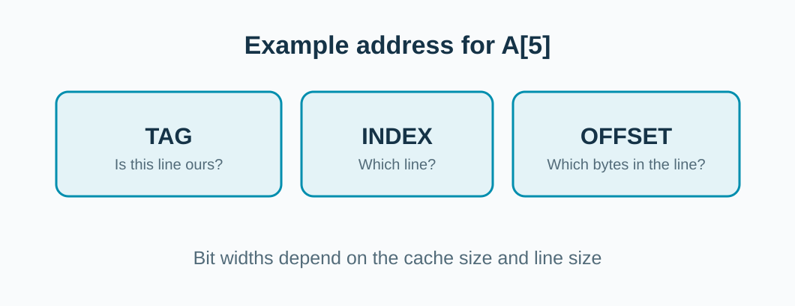
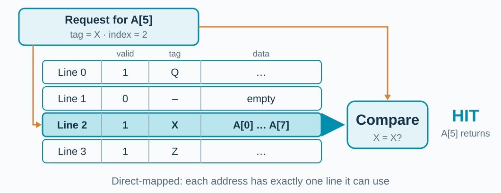
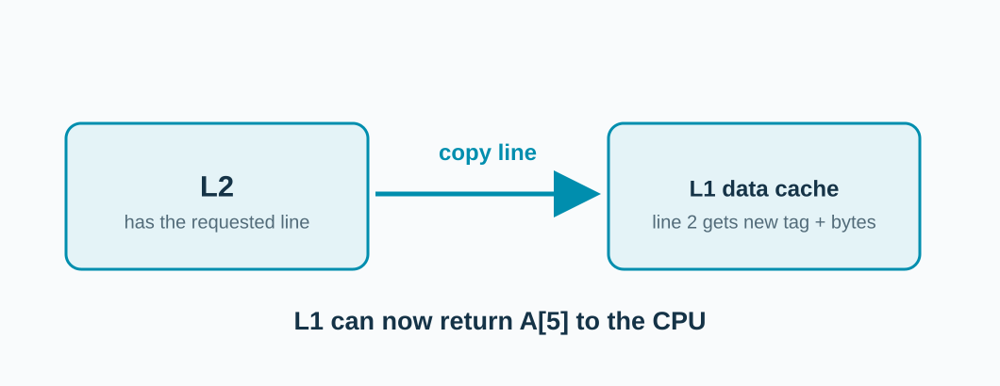

## One address has three parts

**Index finds the set. Tag checks the line. Offset picks the bytes.**

<!-- This is a conceptual address breakdown, not the real bit positions for A[5]. Set indexing and the number of ways depend on the cache design. A cache lookup checks metadata and data for the requested line. Source: gem5 classic memory-system documentation, https://www.gem5.org/documentation/general_docs/memory_system/gem5_memory_system/ . -->

---

## A hit needs a valid, matching tag

**Only way 0 has the requested tag, so its data can return.**

<!-- This is a two-way teaching example, not a circuit diagram of the gem5 Cache SimObject. The selected set has two possible slots (ways). The lookup checks the valid bit and compares both stored tags with the requested tag. If neither matches, request a line from a lower level. gem5's classic cache documentation describes sets, associativity, tags, and valid state: https://www.gem5.org/documentation/general_docs/memory_system/gem5_memory_system/ . -->

---

## A miss fills a line, including its tag

**After the fill, a later request for the same line can hit.**

<!-- The L1 data cache missed in this example; L2 has the line. An L2 miss would go farther. A real cache also handles replacement, permissions, dirty bits, and outstanding requests; these are omitted. The example line is a copy, not a transfer of ownership for all cache designs. Source: gem5 classic memory system documentation, https://www.gem5.org/documentation/general_docs/memory_system/gem5_memory_system/ . -->
