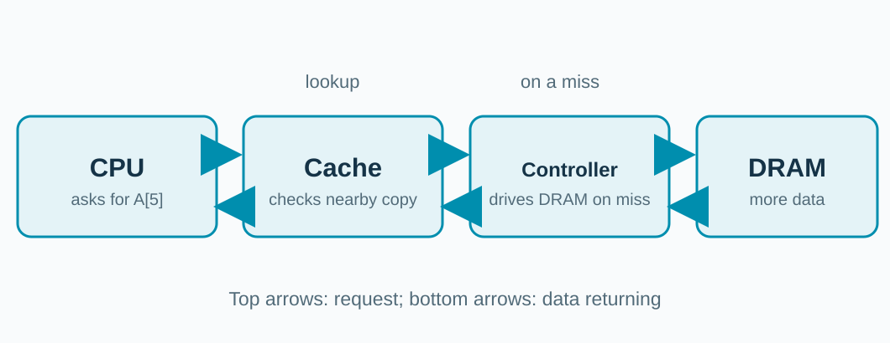

## One address has three parts

In a **direct-mapped** cache, each address has exactly one line it can use.

**Index picks the line. Tag checks it is ours. Offset picks the bytes.**

<!-- This is a conceptual address breakdown, not the real bit positions for A[5]. The line size sets the number of offset bits; the number of lines sets the number of index bits; the tag is the rest of the address. Many addresses share the same index, so the tag records which of them the line currently holds. Source: gem5 classic memory-system documentation, https://www.gem5.org/documentation/general_docs/memory_system/gem5_memory_system/ . -->

---

## A hit needs a valid, matching tag

![The index picks line 2; its stored tag matches the request, so A[5] returns width:970px](../../assets/diagrams/cache-tag-compare.svg)

**Line 2 is valid and its tag is X, so its data can return.**

<!-- This is a direct-mapped teaching example, not a circuit diagram of the gem5 Cache SimObject. The index selects exactly one line, so the lookup needs only one comparison: check the valid bit and compare the stored tag with the requested tag. If the line is not valid or the tag differs, it is a miss: request the line from a lower level. gem5's classic cache documentation describes tags and valid state: https://www.gem5.org/documentation/general_docs/memory_system/gem5_memory_system/ . -->

---

## A miss fills a line, including its tag

**After the fill, a later request for the same line can hit.**

<!-- Suppose line 2 had held a different tag: the L1 data cache misses, and L2 has the line. An L2 miss would go farther. A direct-mapped cache has no choice about where the new line goes: the index picks line 2, and the new tag and bytes replace whatever line 2 held. A real cache also handles permissions, dirty bits, and outstanding requests; these are omitted. The example line is a copy, not a transfer of ownership for all cache designs. Source: gem5 classic memory system documentation, https://www.gem5.org/documentation/general_docs/memory_system/gem5_memory_system/ . -->

---

## A real memory request may stop at a cache

**A cache hit returns the data without visiting DRAM.**

<!-- This connects the video's simplified CPU-to-RAM wires to the workshop machine. For a data request, try the cache first; a miss goes toward the memory controller and DRAM. Instruction fetches also use caches, usually a separate L1 instruction cache. This sketch folds L1 and L2 into one cache box. The memory section comes next: what happens after the controller. -->
