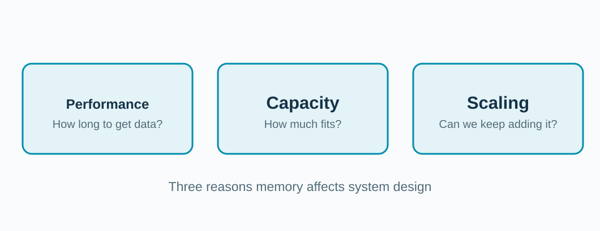
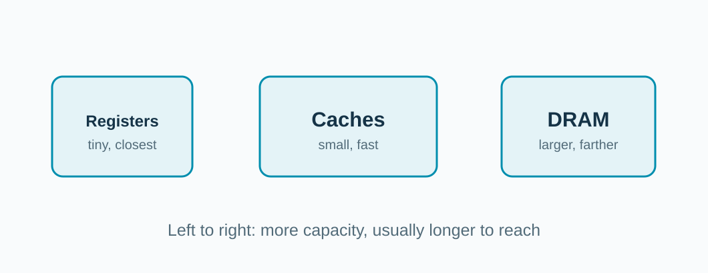
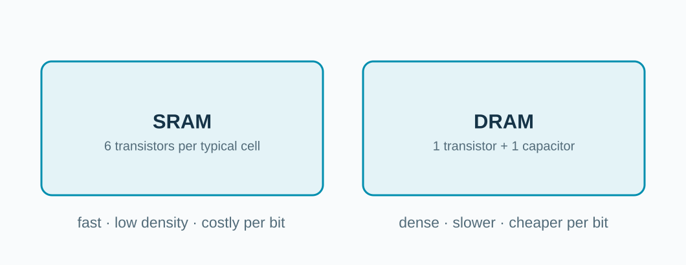
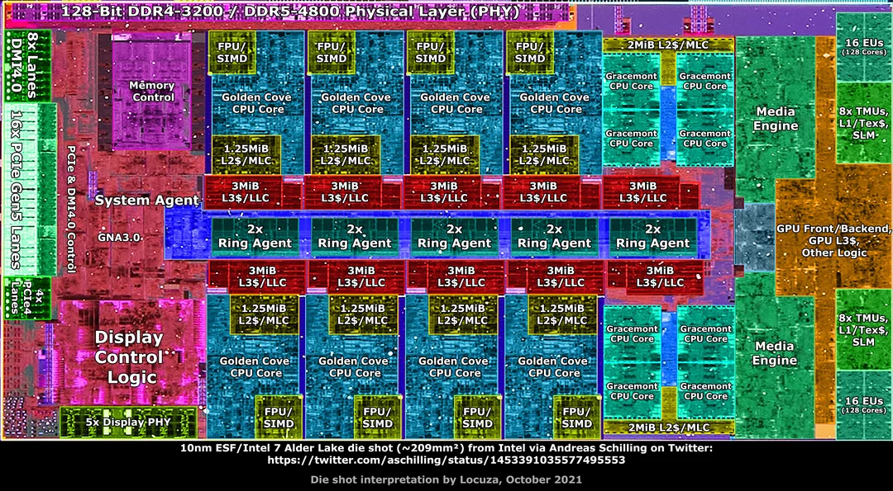
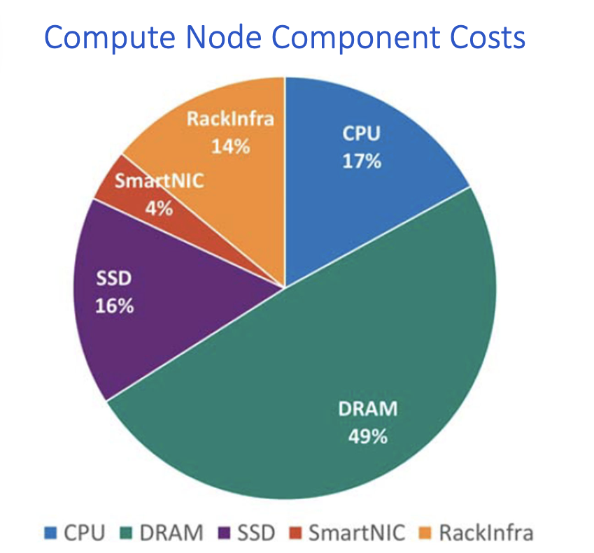

<!-- _class: title -->

## Why is memory important?

**Programs need enough data, delivered soon enough.**

<!-- Ask: what happens if data does not fit, or arrives late? We will study performance, capacity, and scaling in turn. -->

---

## Why does memory need so much attention?

**Why are caches still small?**

**Why do Artificial Intelligence (AI) workloads need so much DRAM?**

<!-- Invite guesses. Caches use costly chip area; many AI models require considerable capacity and memory bandwidth. Define bandwidth as how many bytes can move per second. No particular model size is asserted. -->

---

## One machine has several kinds of memory.

**Near and quick usually means less space.**

<!-- Registers and caches sit on chip; DRAM serves as main memory. The labels show a qualitative tradeoff, not fixed latencies. -->

---

## Why can't the cache hold everything?

**Static RAM (SRAM)** buys speed with chip area. **Dynamic RAM (DRAM)** buys density.

<!-- Six-transistor SRAM and one-transistor/one-capacitor DRAM are representative cell designs, not complete memory devices. Emphasize cost and density, then return to why caches are limited. -->

---

## Real chips devote space to caches.

<!-- Ask audience to find the cores and the regions labeled L3. This is an annotated floorplan of one specific design, not a universal chip layout. The image includes a credit to its annotator. -->

---

## Chip area forces a tradeoff.

**More cache** can help keep data nearby.

**More cores** can increase parallel work.

A chip has limited room for both.

<!-- Ask: what could a designer give up to double a large cache? This is an architectural tradeoff, not a claim that adding cache always removes cores one-for-one. -->

---

## DRAM can dominate a server's cost.

**49% DRAM** in this illustrative server cost mix.

**17% CPU. 16% Solid-State Drive (SSD).**

*Illustrative example; the configuration and date are unspecified.*

<!-- The pie chart has no accompanying bill of materials, date, or system configuration. Treat its percentages as an illustrative cost mix, not a current market statistic. Ask what a memory-intensive machine buys more of. -->
