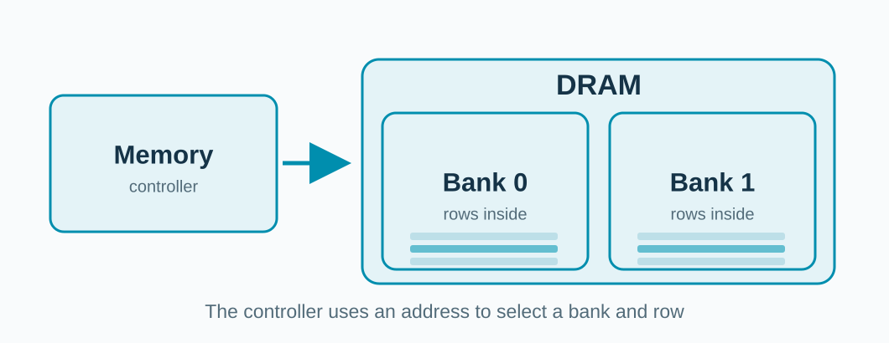
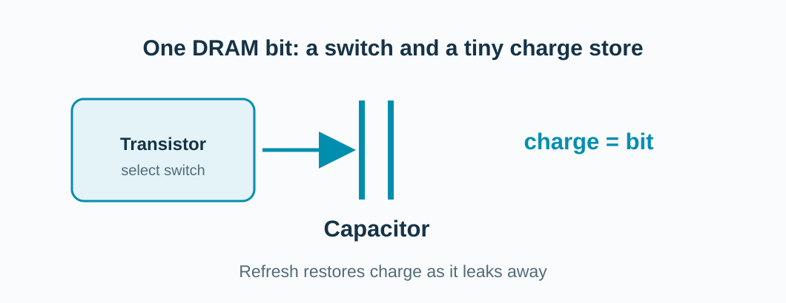
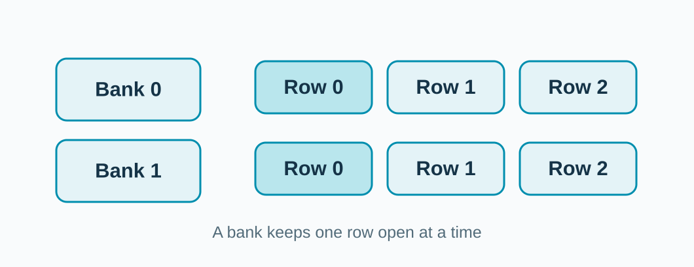
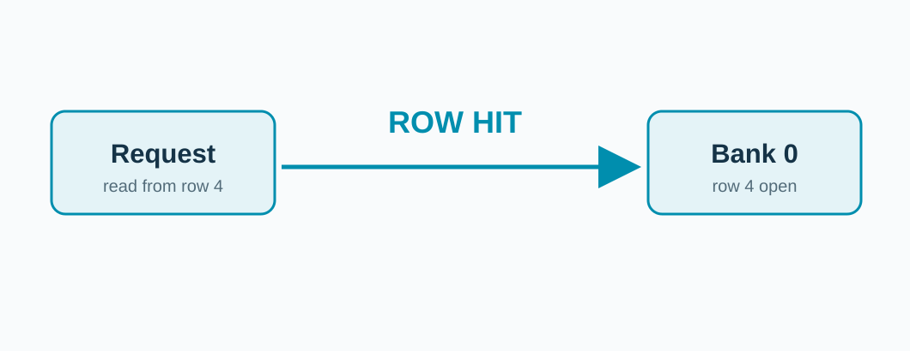
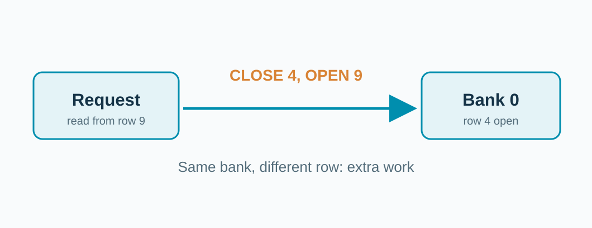

<!-- _class: title -->

## How does DRAM find the data?

**A memory controller selects a bank and a row.**

<!-- The controller is outside the DRAM chips. A DRAM read returns data through the controller toward the caches and CPU. -->

---

## DRAM stores bits as charge.

**A tiny capacitor needs refreshing.**

<!-- This simplified 1T1C cell represents the storage idea, not a production cell layout or precise timing. Then zoom back out to banks and rows. -->

---

## DRAM has independent banks and rows.

<!-- Banks can work somewhat independently; each bank has many rows and can have an open row. The shown rows are a small teaching sample, not the actual geometry of DDR3. -->

---

## Same open row: row hit.

The bank can reuse its open row.

<!-- The request travels toward the bank. A DRAM row buffer hit is different from a CPU cache hit. -->

---

## Different row, same bank: conflict.

Switching rows adds operations.

<!-- The request travels toward the bank. A large stride does not guarantee a row conflict; address mapping can select another bank instead. -->
