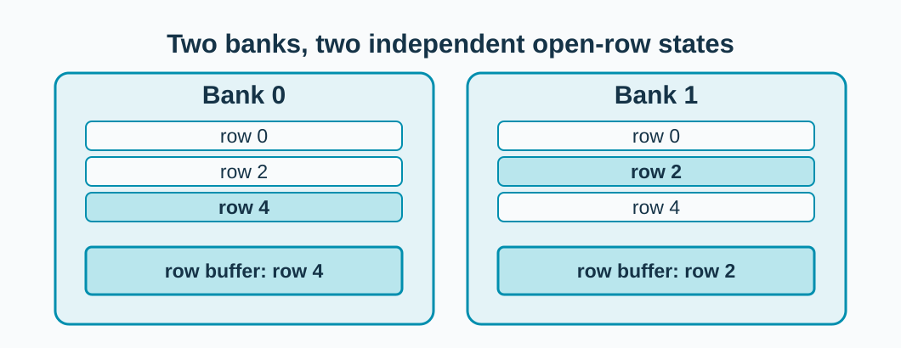
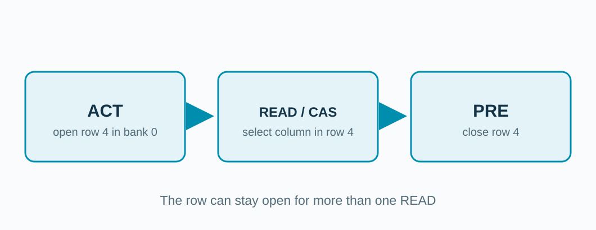
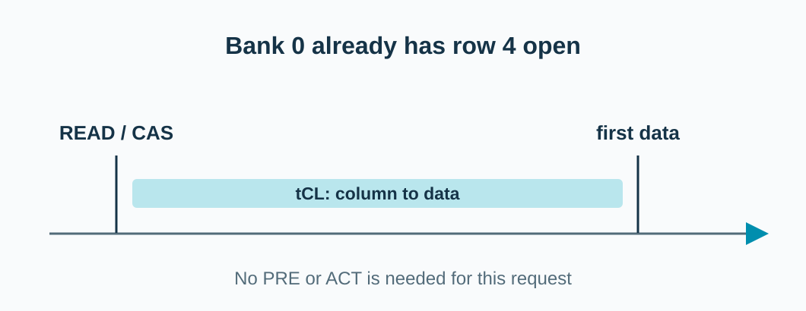
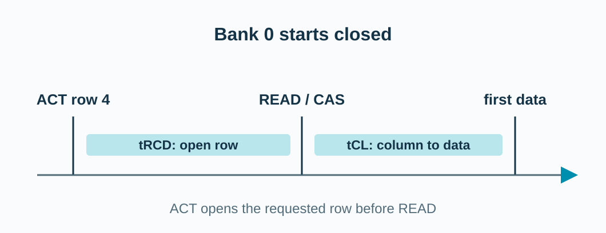
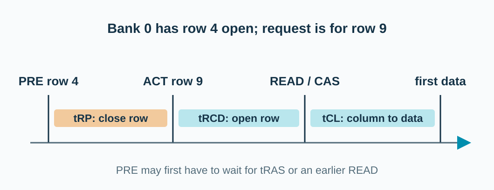
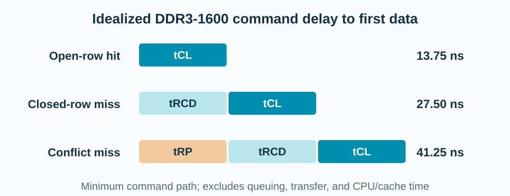

## Each bank has a row buffer

**Two banks can keep different rows open.**

<!-- The selected DRAM bank activates an entire row into its sense-amplifier/row-buffer circuitry. A column READ then accesses part of that open row. Banks have independent row state, but they share other channel resources, so they are not infinitely parallel. This is a schematic, not a physical chip layout. See Micron DDR3 SDRAM datasheet, sections on ACTIVATE and READ: https://www.alliancememory.com/wp-content/uploads/Micron_2Gb_DDR3_SDRAM_PartNo.MT41J128M16JT-107.pdf . -->

---

## Three commands change the bank state

**Activate (ACT) opens. READ / Column Address Strobe (CAS) selects. Precharge (PRE) closes.**

<!-- READ is the DDR3 command carrying a column address. CAS is a common shorthand for this column operation; tCL denotes the READ-to-first-data delay. ACTIVATE and PRECHARGE are commands to the bank. PRE need not occur after every read: an open-page policy can keep the row available for later reads. Source: Micron DDR3 SDRAM datasheet, sections ACTIVATE, READ, and PRECHARGE, https://www.alliancememory.com/wp-content/uploads/Micron_2Gb_DDR3_SDRAM_PartNo.MT41J128M16JT-107.pdf . -->

---

## Row hit: the row is already open

**READ/CAS can begin without a new ACT or PRE.**

<!-- Time starts when this read becomes eligible at the DRAM controller. The bank already holds row 4 open from a previous ACT. The sketch stops at first data from the DRAM interface; it omits queueing, command scheduling, data burst, and the cache-to-CPU return. tCL is the column access latency. Source for the timing term: gem5 DDR3_1600_8x8 interface, https://gem5.googlesource.com/public/gem5/%2B/master/src/python/gem5/components/memory/dram_interfaces/ddr3.py . -->

---

## Row miss: the bank is closed

**The first access to a closed row pays ACT-to-READ delay.**

<!-- A closed/idle bank needs ACT before READ. tRCD is the minimum time from ACT to READ; tCL is READ to first data. These are command constraints, not the full time seen by an application. Source: gem5 DDR3_1600_8x8 timing parameters, https://gem5.googlesource.com/public/gem5/%2B/master/src/python/gem5/components/memory/dram_interfaces/ddr3.py . -->

---

## Row miss: another row is open

**Bank 0 must leave row 4 before it can read row 9.**

<!-- Both addresses map to the same bank but different rows. PRE closes row 4; tRP separates PRE from the next ACT. ACT opens row 9; tRCD precedes READ; tCL precedes first data. PRE itself might have to wait for minimum row-active time tRAS or for a preceding READ's constraints. A request to a different bank can behave differently. Source: Micron DDR3 SDRAM datasheet, timing tables and READ-to-PRE discussion, https://www.alliancememory.com/wp-content/uploads/Micron_2Gb_DDR3_SDRAM_PartNo.MT41J128M16JT-107.pdf . -->

---

## Row state changes the earliest data time

**More bank work means a longer command path.**

<!-- This is a calculation from timing parameters, not a measured gem5 result: gem5's DDR3_1600_8x8 lists tCL=tRCD=tRP=13.75 ns. Assuming a read can issue now (hit), ACT can issue now (closed), or PRE can issue now (conflict), idealized first-data offsets are 13.75, 27.5, and 41.25 ns respectively. The conflict can take longer if tRAS or read-to-precharge blocks PRE. Queueing, scheduling, refresh, other banks, burst transfer, caches, interconnect, and CPU overlap are excluded. Source: https://gem5.googlesource.com/public/gem5/%2B/master/src/python/gem5/components/memory/dram_interfaces/ddr3.py ; Micron DDR3 datasheet https://www.alliancememory.com/wp-content/uploads/Micron_2Gb_DDR3_SDRAM_PartNo.MT41J128M16JT-107.pdf . -->
