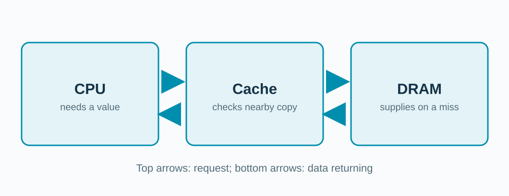

## A small array still needs storage.

```c
int *a = malloc(5 * sizeof(int));
```


<!-- In our C examples, sizeof(int) is four bytes, so five integers need 20 bytes. malloc reserves address space; it does not imply those bytes immediately occupy a particular DRAM row. -->

---

## Here is the machine we will study.



**Which box holds the data the CPU needs next?**

<!-- Use this recurring structure to connect the memory motivation to the next module. Point out that the diagram hides levels of cache and the memory controller; we open those boxes only when needed. -->
