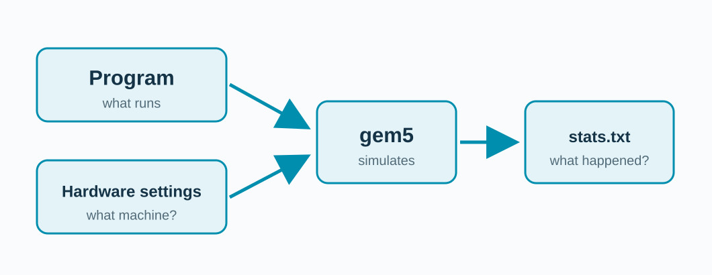

<!-- _class: title -->

## What if we could change the machine?

**gem5 runs the program on a model we choose.**

<!-- Point to two separate inputs: the program runs, while the settings describe the modeled CPU, cache, and DRAM. stats.txt reports what happened in that model. No laptop hardware was changed. -->

---

## Our one modeled computer.

**RISC-V SE · one TimingSimpleCPU · L1 I/D · shared L2 · DDR3**

We will vary one part at a time.

<!-- This is the actual structure in configs/workshop.py. The separate L1 instruction cache exists but the visual request path elsewhere follows data through L1D. -->

---

## Simulation has limits.

**A model can explain a trend. It is not a physical benchmark.**

We compare like-for-like runs within this configuration.

<!-- Model fidelity, workload, ISA target, and calibration matter. Simulated seconds differ from the wall time taken by gem5 itself. -->
