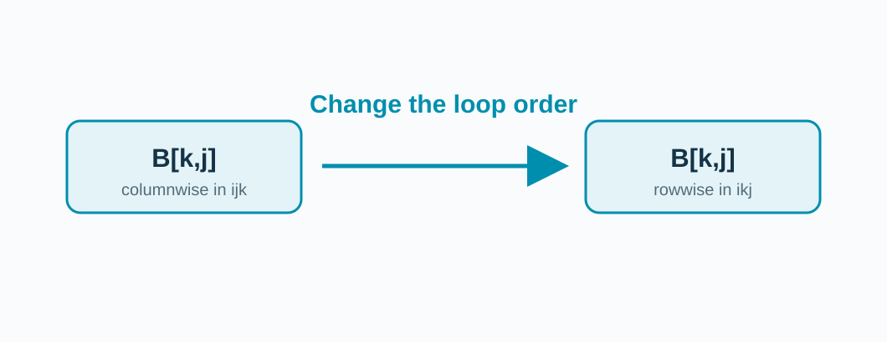
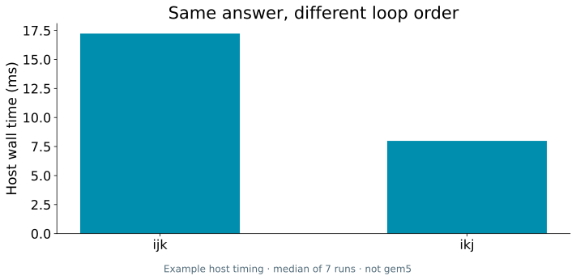

<!-- _class: title -->

## A familiar calculation, repeated data.

**Matrix multiplication** revisits rows and columns many times.

Can we change the visit order without changing the answer?

<!-- Draw a 2×2 example verbally. Explain that both programs compute the same integer matrix product. -->

---

## Two loop orders.

**Pseudocode** (complete C program in `examples/matmul/`).

```c
// Original              // Rearranged
for (i ...)             for (i ...)
  for (j ...)             for (k ...)
    for (k ...)             for (j ...)
      C[i,j] += A[i,k]*B[k,j];
```

<!-- Display code conceptually; complete runnable implementations are in examples/matmul/main.c. Read the i, j, k order aloud. -->

---

## The B visits change direction.



**Same arithmetic. Different route through memory.**

<!-- The diagram shows the change in how B is visited without promising a particular DRAM row count. -->

---

## A measured example: loop order.



**Same checksum; host timing only.**

<!-- Show the CSV and reproduction command in scripts/host_demo.py. The host measurement motivates the model experiment; it cannot by itself prove a cache or DRAM cause. -->

---

## How would you prove the speedup?

**Check the checksum. Compare simulated seconds. Inspect L1 misses.**

```bash
./run-se.sh matmul matmul/ijk --arg 96 --arg ijk
./run-se.sh matmul matmul/ikj --arg 96 --arg ikj
```

<!-- Before running, ask which arrangement offers more spatial reuse on row-major C arrays. Discuss processor caches versus DRAM row locality separately. -->
