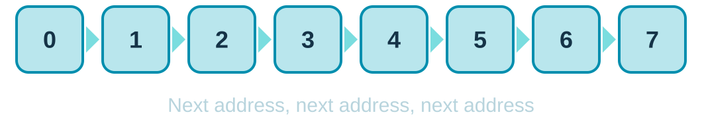
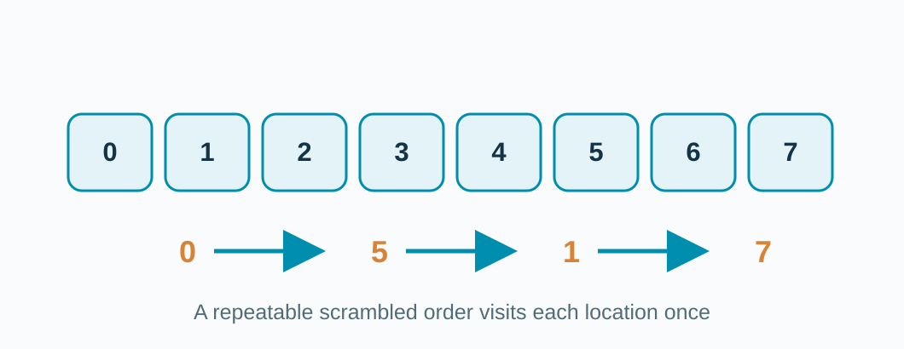
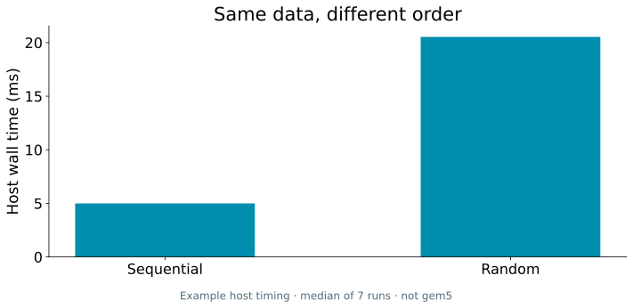

<!-- _class: title -->

## Same data. Different order.



Now change the visit order.

<!-- Ask the room to predict which order can reuse a fetched line. Do not assert that all systems show the same speedup. -->

---

## The next value may already be nearby.

```c
for (size_t i = 0; i < n; ++i)
    sum += a[i];
```

**Sequential access:** neighbors arrive together.

<!-- This is a shortened teaching snippet from examples/sequential. The actual program also initializes and validates the array. -->

---

## Now jump through the array.



**Random access:** the next address may be far away.

<!-- The runnable random example uses an invertible deterministic index mixer. It visits every element once per pass but computes more index arithmetic. -->

---

## Prediction: which finishes first?

**A: sequential**　　　**B: random order**

Same array size, checksum, CPU model, and memory.

The loop that picks the next element changes.

<!-- Take a vote. The random order also changes instruction arithmetic slightly; discuss this limitation when reading timing and miss counts. -->

---

## Measured on a real CPU.



**Measured CPU time. Run the gem5 experiment to inspect cache misses.**

<!-- Compare the two actual measurements in assets/plots/host-measurements.csv. They are from seven host subprocess runs, not simulated time. Ask what else we need to inspect to argue for a memory explanation. -->

---

## Time alone does not explain the gap.

The random program also computes its indexes differently.

Check **instruction count** before blaming memory.

Then compare **L1 data misses** and **DRAM reads**.

<!-- Explain the two possible causes. More index arithmetic adds instructions; worse data locality can add misses. Compare simInsts, demand misses, read bursts, and simSeconds from the actual gem5 runs before drawing a causal conclusion. -->
